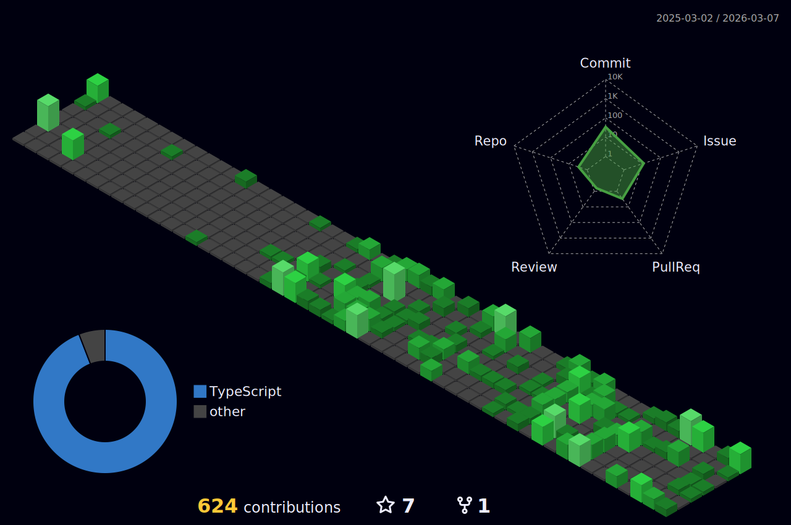

## Resumo

Sou apaixonado por desenvolvimento de software e motivado por desafios que envolvem aprendizado contínuo, resolução de problemas e colaboração com pessoas. Programar, estudar novas abordagens, explorar padrões e arquiteturas são atividades que me mantêm em constante evolução. Acredito que a tecnologia é um meio poderoso de transformar ideias em soluções reais, e é isso que me move como desenvolvedor.

[Abrir página pessoal!](https://landing-page-person.vercel.app/)

## Contatos

 
  
  
    

## Atividades

## Habilidades

  

