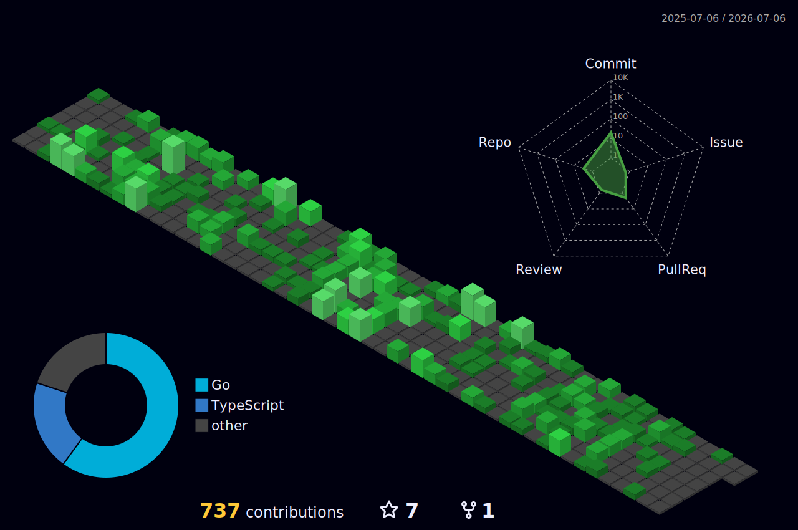

Desenvolvedor de software com experiência na construção de soluções seguras e escaláveis para os setores de Health Tech e Meios de Pagamento. Focado na resolução de problemas complexos, aplicação de padrões de arquitetura e melhoria contínua. Movido pelo propósito de usar a tecnologia para transformar ideias em produtos que geram valor real.

[🔗 ABRIR PÁGINA PESSOAL](https://landing-page-person.vercel.app/)

## Contatos

 
  
  
    

## Atividades

## Habilidades

  

