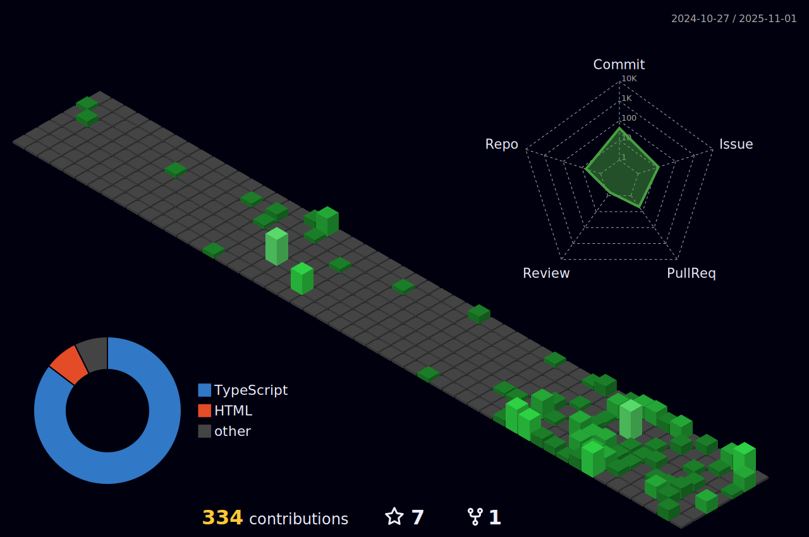

## Resumo

Sinto prazer no que faço, programar, aprender, lidar com pessoas me faz me sentir dinâmico e em plena eficiêcia, buscando sempre novas formas, novos padrões, arquitetura.. isso sim me faz sentir prazer no que eu faço, afinal sou um desenvolvedor. 

[Abrir página pessoal!](https://landing-page-person.vercel.app/)

## Contatos

 
  
  
    

## Atividades

## Habilidades

  

